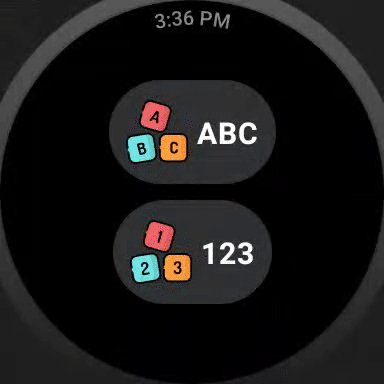

#  ABC Watch

This repo holds Android WearOS **ABC Watch** app.

The app is designed for curious toddlers interested in learning Alphabets and Numbers on their parents' Smart Watch.

If the device supports, the app also takes advantage or the TextToSpeech service to read the letter or digit.

The UI is designed using Jetpack Compose, Compose Navigation is used for WearOS is used for navigation, Koin is used as DI, and MVVM is the architecture hired for the presentation layer.
